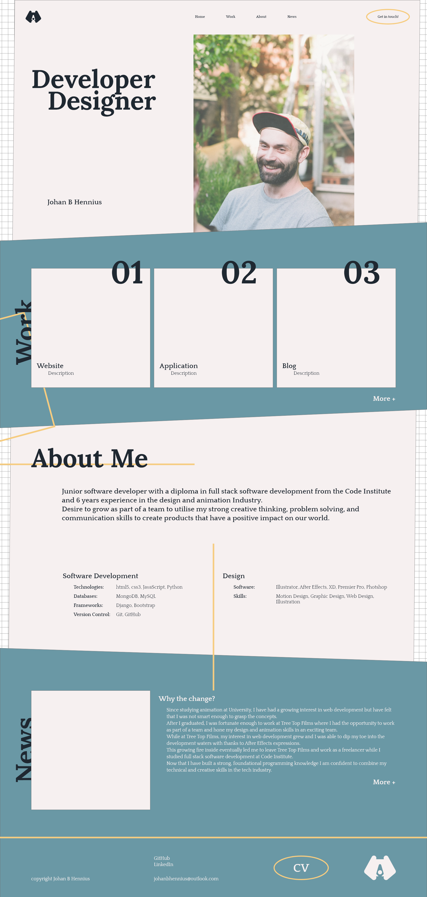

# portfolio-website

V1 - 21/11/2023

A portfolio website where i try out new techniques while showcasing some of my favourite projects. 

## Specifications

Create a website where i can showcase my favourite portfolio pieces with the website itself being another piece.

- Home page with links to projects, about me section, and most up-to-date 'blog' post. 
- Responsive design. 
- JavaScript animation for text and scroll reveal.
- Dedicated pages to each project with detailed description of process.
- Downloadable CV.
- Contact - email.

## Ideation

The first stage in this design process was to figure out my user stories. I decided to keep it simple.

"As an empployer i want to clearly see a future employees skills so that i can decided if they are suitable for the role"

This gave me some clear guidelines for the site features. After this was done, i went on to  looking at suitable points of inspiration. 

[https://designdough.co.uk/](designdough)
[https://www.torebentsen.com/](Tore S Bentsen)
[https://www.boldscandinavia.com/](Bold Scandinavia)
[https://www.pinterest.co.uk/johanbhennius/web-dev/](Pinterest)

These incerdible sources of inspiration filled my mind with ideas. I took to Adobe XD and began designing.

## Build

In order to push myself with this build, i set some targets:

- Create a responsive site using custom breakpoints.
- Create an interesting background built with gradients and CSS shapes.
- Animate navbar text using JavaScript.
- Utilise Grid and flexbox efficiently.

I began building the project by trying focus on the basic structure. Once everything was in place, i focused on styling, and eventually animation. 
It's difficult to stick to this workflow and in all honesty, im unsure if it is the most efficient... 
The main difficulty is keeping yourself focused and disciplined so that the focus is on the immediate bite-sized task at hand. 
I think that this is something which will improve with time and dedication. 

## Issues

- Image behaviour when resizing.
- Proportions of news section.
- Navbar behaviour for small screens.

## Future changes

- Adjust news section to improve proportions and responsive behaviour.
- Utilise responsive font sizes with clamp().

## Acknowledgements

[https://www.youtube.com/@KevinPowell](Kevin Powell)
[https://www.youtube.com/@WebDevSimplified](Web Dev Simplified)
[https://www.youtube.com/@codegrid](Code Grid)
[https://www.youtube.com/@beyondfireship](Beyond Fireship)
